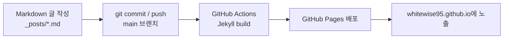

# whitewise95.github.io

Jekyll과 GitHub Pages로 운영하는 개인 기술 블로그입니다.
글은 Markdown 파일로 관리하며, `main` 브랜치에 변경사항을 push하면 GitHub Actions가 사이트를 빌드해 배포합니다.

- 운영 URL: [https://whitewise95.github.io](https://whitewise95.github.io)
- 저장소: `whitewise95/whitewise95.github.io`
- 테마 기반: Jekyll `minima` + 커스텀 Quiet Signal 스타일
- 현재 주요 주제: Java, Spring Batch, Spring AI

## 목차

1. 동작 방식 한눈에 보기
2. 폴더와 파일 구조
3. 처음 실행하기
4. 로컬에서 확인하기
5. 새 글 작성하기
6. 카테고리 관리하기
7. 이미지와 코드블록 사용하기
8. 홈과 디자인 수정하기
9. 배포하기
10. 문제 해결 가이드
11. 운영 체크리스트

---

## 1. 동작 방식 한눈에 보기

이 블로그에는 별도의 DB나 관리자 페이지가 없습니다. 글 한 편은 `_posts/` 안의 Markdown 파일 한 개입니다.



실제 운영 흐름은 아래처럼 단순합니다.

1. `_posts/`에 Markdown 글을 추가하거나 수정합니다.
2. 로컬에서 필요하면 미리보기를 확인합니다.
3. Git에 커밋하고 `main`에 push합니다.
4. `.github/workflows/pages.yml`이 실행됩니다.
5. 빌드에 성공하면 블로그에서 변경된 글을 볼 수 있습니다.

### 반드시 기억할 점

- 웹 에디터나 CMS가 포함된 프로젝트가 아닙니다.
- 글을 추가한다는 것은 실제 `.md` 파일을 저장소에 추가한다는 뜻입니다.
- 배포 오류가 생기면 우선 GitHub Actions의 빌드 로그를 확인합니다.

---

## 2. 폴더와 파일 구조

```text
.
├── .github/
│   └── workflows/
│       └── pages.yml             # GitHub Pages 빌드/배포 workflow
├── _layouts/
│   └── default.html              # 공통 레이아웃, 헤더/사이드 탐색/본문/푸터
├── _posts/                       # 게시글 Markdown 파일
├── assets/
│   ├── main.scss                 # 전체 디자인 토큰과 컴포넌트 스타일
│   └── posts/                    # 글에서 사용하는 이미지 파일
├── _config.yml                   # Jekyll 사이트 설정 및 상단 메뉴
├── index.md                      # 홈: 기술 스택 화면
├── java.md                       # Java 글 목록 페이지
├── spring-batch.md               # Spring Batch 글 목록 페이지
├── spring-ai.md                  # Spring AI 글 목록 페이지
├── Gemfile                       # Ruby/Jekyll 의존성
└── README.md                     # 현재 문서
```

### 주요 파일의 역할

| 파일 | 역할 | 언제 수정하는가 |
| --- | --- | --- |
| `_config.yml` | 사이트 이름, URL, permalink 규칙, 상단 메뉴 설정 | 블로그 정보 또는 메뉴를 바꿀 때 |
| `_posts/*.md` | 실제 게시글 | 새 글 작성, 기존 글 수정 시 |
| `java.md` | `Java` 카테고리 글 목록 출력 | Java 목록 페이지 설명/구조 변경 시 |
| `spring-batch.md` | `스프링배치` 카테고리 글 목록 출력 | Batch 목록 페이지 변경 시 |
| `spring-ai.md` | `spring-ai` 카테고리 글 목록 출력 | Spring AI 목록 페이지 변경 시 |
| `index.md` | 홈의 기술 스택 카드 콘텐츠 | 소개 기술을 추가/삭제할 때 |
| `_layouts/default.html` | 전체 페이지 외곽 구조 | 내비게이션/사이드바 구조를 바꿀 때 |
| `assets/main.scss` | 컬러, 본문, 카드, 코드블록, 반응형 스타일 | 디자인을 바꿀 때 |
| `.github/workflows/pages.yml` | 자동 배포 파이프라인 | 빌드 방식/Actions 버전 수정 시 |

---

## 3. 처음 실행하기

### 3-1. 저장소 내려받기

기존 저장소를 운영하는 경우:

```bash
git clone git@github.com:whitewise95/whitewise95.github.io.git
cd whitewise95.github.io
```

이 소스를 복제해 새로운 사용자 블로그로 쓰는 경우에는 먼저 GitHub에
`<github-username>.github.io` 저장소를 만든 뒤 원격 주소를 변경합니다.

```bash
git remote set-url origin git@github.com:<github-username>/<github-username>.github.io.git
```

### 3-2. 필요한 환경

GitHub Actions는 Ruby `3.3`에서 빌드하도록 설정되어 있습니다. 로컬도 같은 버전을 쓰는 편이 안정적입니다.

- Git
- Ruby `3.3`
- Bundler

Ruby 버전 확인:

```bash
ruby -v
bundle -v
```

> macOS 기본 Ruby는 오래된 버전일 수 있습니다. 로컬에서 gem 설치 오류가 나면 `rbenv` 또는 `asdf`로 Ruby 3.3을 설치한 뒤 다시 진행하는 것을 권장합니다.

### 3-3. 의존성 설치

```bash
bundle config set path vendor/bundle
bundle install
```

이 저장소의 주요 의존성은 다음과 같습니다.

| Gem | 용도 |
| --- | --- |
| `github-pages` | GitHub Pages가 지원하는 Jekyll 및 플러그인 묶음 |
| `webrick` | 로컬 Jekyll 서버 실행 지원 |

---

## 4. 로컬에서 확인하기

### 개발 서버 실행

```bash
bundle exec jekyll serve
```

브라우저에서 아래 주소를 엽니다.

```text
http://127.0.0.1:4000
```

글이나 스타일을 수정할 때 파일 변경사항이 자동으로 다시 빌드됩니다. 설정 파일인 `_config.yml`을 바꾼 경우에는 서버를 재시작하는 편이 안전합니다.

### 배포용 빌드만 검증하기

```bash
bundle exec jekyll build --source . --destination ./_site --trace --verbose
```

성공하면 생성 결과가 `_site/` 디렉터리에 만들어집니다. `_site/`는 빌드 결과물이므로 Git에 커밋하지 않습니다.

---

## 5. 새 글 작성하기

### 5-1. 파일 위치와 파일명

모든 글은 `_posts/` 안에 저장합니다.

```text
_posts/YYYY-MM-DD-english-slug.md
```

예시:

```text
_posts/2026-05-25-spring-ai-chat-memory.md
```

파일명 앞 날짜는 Jekyll이 게시글로 인식하기 위한 기본 규칙입니다. slug는 URL과 관리 편의성을 위해 영문 소문자와 하이픈 사용을 권장합니다.

### 5-2. 기본 Front Matter

글 파일의 가장 위에는 반드시 YAML Front Matter가 있어야 합니다.

```markdown
---
layout: post
title: "Spring AI Chat Memory 시작하기"
date: 2026-05-25 10:00:00 +0900
categories: [spring-ai]
permalink: /spring-ai/spring-ai-chat-memory/
---

## 들어가며

본문을 작성합니다.
```

### Front Matter 필드 설명

| 필드 | 필수 여부 | 설명 | 예시 |
| --- | --- | --- | --- |
| `layout` | 필수 | 게시글 레이아웃. 일반 글은 `post` 사용 | `post` |
| `title` | 필수 | 화면과 목록에 노출되는 제목 | `"Java 25 주요 변경사항"` |
| `date` | 필수 | 게시일과 정렬 기준. 시간대 포함 권장 | `2026-05-25 10:00:00 +0900` |
| `categories` | 권장 | 목록 페이지에서 글을 분류하는 키 | `[spring-ai]` |
| `tags` | 선택 | 글 주제 메타데이터 | `[spring-ai, prompt]` |
| `permalink` | 권장 | 글의 고정 URL | `/spring-ai/example/` |

### 5-3. 현재 사용하는 카테고리 키

카테고리 값은 목록 페이지의 Liquid 코드와 **정확히 일치**해야 합니다.

| 화면에 보이는 분류 | 글에 넣을 값 | 목록 페이지 |
| --- | --- | --- |
| Java 버전별 정리 | `categories: [Java]` | `java.md` |
| 스프링배치 | `categories: [스프링배치]` | `spring-batch.md` |
| Spring AI | `categories: [spring-ai]` | `spring-ai.md` |

예를 들어 Spring AI 글을 `categories: ["Spring AI"]`로 작성하면 현재 `spring-ai.md` 목록에 나오지 않습니다. 이 프로젝트에서는 `spring-ai`를 키로 사용합니다.

### 5-4. 미래 날짜 주의

Jekyll은 현재 시각보다 미래인 게시글을 기본적으로 화면에 표시하지 않습니다.

```yaml
date: 2026-05-25 23:30:00 +0900
```

현재가 같은 날 오전이라면 위 글은 아직 목록과 URL에 노출되지 않을 수 있습니다. 즉시 공개하려면 현재보다 이전 시각을 사용합니다.

### 5-5. 글 작성 예시

````markdown
---
layout: post
title: "Java 26 주요 변경사항"
date: 2026-05-25 09:00:00 +0900
categories: [Java]
tags: [java, java-26, release-notes]
permalink: /java/java-26-major-changes/
---

## 개요

Java 26의 주요 변경사항을 정리합니다.

## 핵심 변화

| 변경사항 | 설명 | 실무 영향 |
| --- | --- | --- |
| 기능명 | 기능 설명 | 적용 포인트 |

## 코드 예시

```java
public class Example {
    public static void main(String[] args) {
        System.out.println("Hello, Java");
    }
}
```
````

---

## 6. 카테고리 관리하기

### 6-1. 기존 카테고리에 글 추가하기

기존 분류에 글을 넣을 때는 해당 키만 정확히 입력하면 됩니다.

```yaml
categories: [스프링배치]
```

`spring-batch.md`가 `site.categories["스프링배치"]`를 읽어 자동으로 목록에 표시합니다.

### 6-2. 새 카테고리 만들기

예를 들어 `Spring Security` 카테고리를 추가한다고 가정합니다.

1. 글의 category 키를 하나 정합니다. 공백 문제를 피하려면 `spring-security`처럼 단순한 영문 키를 권장합니다.
2. 루트에 목록 페이지 파일을 추가합니다.
3. `_config.yml`의 `header_pages`에 등록합니다.
4. 해당 category 키를 가진 글을 추가합니다.

새 목록 페이지 예시: `spring-security.md`

```markdown
---
layout: page
title: Spring Security
permalink: /spring-security/
---

Spring Security 글 목록입니다.



  

  



<section class="series-board" aria-label="Spring Security posts board">
  <ul class="series-board-list">
  
    <li class="series-board-item">
      <a class="series-board-link" href="{{ post.url | relative_url }}">
        <div class="series-board-main">
          <span class="series-board-badge">Spring Security</span>
          <h3 class="series-board-title">{{ post.title }}</h3>
          <p class="series-board-meta">기술 문서</p>
        </div>
        <time class="series-board-date">{{ post.date | date: "%Y-%m-%d" }}</time>
      </a>
    </li>
  
  </ul>
</section>

아직 작성된 글이 없습니다.

```

`_config.yml` 메뉴 등록:

```yaml
header_pages:
  - java.md
  - spring-batch.md
  - spring-ai.md
  - spring-security.md
```

글에 적용:

```yaml
categories: [spring-security]
```

### 카테고리 오류 방지 규칙

- `site.categories["키"]`와 글의 `categories: [키]` 값을 똑같이 씁니다.
- 목록을 정렬하기 전 `nil` 또는 빈 목록 검사를 유지합니다.
- 한글 키도 사용할 수 있지만, 새 카테고리에는 영문 소문자와 하이픈 키를 권장합니다.

---

## 7. 이미지와 코드블록 사용하기

### 7-1. 이미지 넣기

게시글 이미지 파일은 `assets/posts/` 아래에 글별 폴더로 관리하는 것을 권장합니다.

```text
assets/posts/spring-ai-chat-memory/diagram.png
```

Markdown에서 사용하는 방법:

```markdown

```

권장 규칙:

- 파일명은 영문 소문자와 하이픈을 사용합니다.
- 이미지는 의미 있는 `alt` 텍스트를 작성합니다.
- 이미지 하나가 너무 크면 웹용 크기로 줄인 뒤 추가합니다.

### 7-2. 코드블록 넣기

코드블록에는 언어 이름을 반드시 적습니다. 문법 하이라이트가 적용되고 읽기 쉬워집니다.

````markdown
```java
public record Member(Long id, String name) {
}
```
````

현재 `assets/main.scss`에는 Rouge가 생성하는 코드 하이라이트 토큰의 색상도 정의되어 있습니다. 코드블록의 배경이나 텍스트 색상을 수정할 때는 `.post-content .highlight` 관련 스타일도 함께 확인합니다.

### 7-3. 표 작성하기

```markdown
| 항목 | 설명 |
| --- | --- |
| Job | 배치 작업 전체 |
| Step | 작업의 실행 단위 |
```

긴 표는 모바일에서 가로 스크롤되도록 스타일이 적용되어 있습니다.

---

## 8. 홈과 디자인 수정하기

### 8-1. 홈 기술 스택 변경

홈 화면은 `index.md`에 작성되어 있습니다.

```html
<article class="tech-card" id="backend">
  <h2>Backend</h2>
  <ul>
    <li>Java</li>
    <li>Spring Boot / Spring</li>
  </ul>
</article>
```

기술을 추가하려면 `<li>` 항목을 추가하면 됩니다. 현재 카드의 첫 번째 태그는 대표 기술로 accent 색상이 적용됩니다.

홈의 왼쪽 사이드 탐색은 `_layouts/default.html`에 있는 아래 앵커와 연결됩니다.

| 사이드 메뉴 | `index.md`의 id |
| --- | --- |
| 개요 | `stack-overview` |
| Backend | `backend` |
| Database | `database` |
| Realtime | `realtime` |
| 기타 | `etc` |

카드를 추가하면서 사이드바에서도 탐색하게 만들려면 두 위치를 함께 수정합니다.

### 8-2. 디자인 시스템 구조

전체 스타일은 `assets/main.scss`에서 관리합니다. 기본 방향은 따뜻한 오프화이트 배경과 차분한 기술 블로그 인터페이스입니다.

대표 토큰:

```scss
:root {
  --color-bg: #faf8f3;
  --color-surface: #ffffff;
  --color-surface-soft: #f3efe7;
  --color-text: #1f2933;
  --color-muted: #667085;
  --color-border: #e5ded2;
  --color-accent: #7c3aed;
  --color-accent-soft: #ede9fe;
}
```

주요 스타일 구간:

| 선택자 | 대상 |
| --- | --- |
| `.site-header`, `.site-nav` | 상단 브랜드/카테고리 탐색 |
| `.page-shell`, `.sidebar-nav` | 전체 2단 레이아웃과 보조 탐색 |
| `.post-title`, `.post-content` | 글 제목과 본문 |
| `.highlight`, `pre`, `code` | 코드블록 및 문법 강조 |
| `.series-board-*` | 카테고리의 글 카드 목록 |
| `.tech-*` | 홈 기술 스택 영역 |

### 8-3. 반응형 구조

- 데스크톱: 왼쪽 보조 탐색 + 오른쪽 콘텐츠 2단 구조
- 태블릿/모바일(`900px` 이하): 사이드 탐색이 콘텐츠 위로 이동
- 모바일: 기술 카드와 글 카드가 한 열로 배치

---

## 9. 배포하기

### 9-1. GitHub Pages 최초 설정

GitHub 저장소에서 다음을 설정합니다.

1. `Settings`로 이동합니다.
2. `Pages` 메뉴를 엽니다.
3. `Build and deployment`의 Source를 `GitHub Actions`로 설정합니다.

### 9-2. 배포 Workflow

배포 파일은 `.github/workflows/pages.yml`입니다.

현재 동작:

- `main` 브랜치 push 시 자동 실행
- 수동 실행(`workflow_dispatch`) 지원
- Ruby `3.3`에서 Bundler 캐시 사용
- `bundle exec jekyll build` 실행
- `_site` 결과물을 GitHub Pages에 배포
- 새로운 배포가 들어오면 이전 진행 중 배포를 취소하고 최신 커밋을 우선 처리

### 9-3. 글 배포 순서

```bash
git status
git add _posts/2026-05-25-example.md
git commit -m "Add example post"
git push origin main
```

스타일 또는 페이지도 함께 바꿨다면 필요한 파일을 같이 `git add` 합니다.

```bash
git add assets/main.scss index.md
git commit -m "Refine home styling"
git push origin main
```

### 9-4. 배포 확인

1. 저장소의 `Actions` 탭을 엽니다.
2. `Deploy Jekyll site to Pages` workflow가 성공했는지 확인합니다.
3. 사이트 URL 또는 작성한 `permalink` URL에 접속합니다.

GitHub Pages 배포와 CDN 캐시 반영 때문에 push 직후 잠시 이전 화면이 보일 수 있습니다.

---

## 10. 문제 해결 가이드

### 글이 목록에 보이지 않는다

우선 아래를 확인합니다.

| 확인 항목 | 문제 예시 | 해결 |
| --- | --- | --- |
| 카테고리 키 | `Spring AI`로 썼는데 목록 페이지는 `spring-ai` 조회 | 키를 `spring-ai`로 통일 |
| 글 날짜 | 현재보다 미래인 `date` | 현재 이전 시간으로 변경하거나 공개 시각까지 대기 |
| 파일 위치 | `_posts/` 밖에 작성 | `_posts/`로 이동 |
| front matter | `---` 구문 누락 | 파일 맨 위 YAML 블록 보완 |

### 빌드에서 `Cannot sort a null object`가 발생한다

카테고리 목록이 없는데 Liquid에서 곧바로 `sort`를 호출한 경우 발생할 수 있습니다. 현재 목록 페이지처럼 먼저 빈 값을 처리해야 합니다.

```liquid


  

  

```

### `Liquid syntax error`가 발생한다

카테고리를 점 표기법으로 접근하거나 키에 공백/한글이 섞인 상태에서 문법을 잘못 쓰면 오류가 생길 수 있습니다.

권장 방식:

```liquid

```

새 카테고리는 가능한 `spring-security` 같은 간결한 키를 정해 쓰면 유지보수가 편합니다.

### GitHub Actions에 Node.js deprecation 경고가 뜬다

경고가 곧 빌드 실패 원인은 아닐 수 있습니다. 이 workflow에는 `FORCE_JAVASCRIPT_ACTIONS_TO_NODE24: true` 설정이 들어 있습니다. 빌드가 실패했다면 로그에서 `Liquid Exception`, `Jekyll`, `Error:` 다음의 실제 원인을 먼저 확인합니다.

### 코드블록 글자가 배경과 섞여 보인다

문법 하이라이트는 `assets/main.scss`의 `.post-content .highlight` 및 하위 Rouge 토큰 스타일이 담당합니다. 배경색을 변경할 때 아래 계열 색상도 함께 점검합니다.

- 키워드: `.k`, `.kd`, `.kt`
- 문자열: `.s`, `.s1`, `.s2`
- 함수/클래스: `.nf`, `.nc`
- 주석: `.c`, `.c1`, `.cm`

### 로컬에서 `jekyll` 실행 파일을 찾지 못한다

```bash
bundle config set path vendor/bundle
bundle install
bundle exec jekyll serve
```

그래도 실패하면 Ruby 버전을 먼저 확인합니다. GitHub Actions와 같은 Ruby `3.3`을 사용하는 것이 가장 안정적입니다.

---

## 11. 운영 체크리스트

### 새 글을 발행하기 전

- [ ] 파일이 `_posts/YYYY-MM-DD-slug.md` 형태인가?
- [ ] `layout: post`가 들어 있는가?
- [ ] `date`가 현재보다 미래가 아닌가?
- [ ] `categories` 키가 대상 목록 페이지와 정확히 같은가?
- [ ] `permalink`가 기존 글과 충돌하지 않는가?
- [ ] 코드블록에 언어 타입을 적었는가?
- [ ] 이미지의 경로와 alt 텍스트가 맞는가?

### 배포한 뒤

- [ ] GitHub Actions 빌드가 성공했는가?
- [ ] 글 URL이 정상 접근되는가?
- [ ] 카테고리 목록에 새 글이 나타나는가?
- [ ] 데스크톱과 모바일에서 코드블록/표가 깨지지 않는가?

### 디자인을 수정할 때

- [ ] `assets/main.scss` 토큰을 먼저 재사용했는가?
- [ ] 홈, 목록, 글 상세 페이지 모두에서 스타일을 확인했는가?
- [ ] 라이트/다크 모드에서 텍스트 대비가 유지되는가?
- [ ] `900px` 이하 화면에서 카드와 메뉴가 자연스럽게 쌓이는가?

---

## 빠른 시작 요약

처음 글 하나를 발행하려면 아래 순서만 따라 하면 됩니다.

```bash
git clone git@github.com:whitewise95/whitewise95.github.io.git
cd whitewise95.github.io
bundle config set path vendor/bundle
bundle install
bundle exec jekyll serve
```

`_posts/2026-05-25-my-first-post.md`를 작성합니다.

```markdown
---
layout: post
title: "첫 게시글"
date: 2026-05-25 10:00:00 +0900
categories: [spring-ai]
permalink: /spring-ai/my-first-post/
---

## 첫 게시글

본문을 작성합니다.
```

배포합니다.

```bash
git add _posts/2026-05-25-my-first-post.md
git commit -m "Add first post"
git push origin main
```

Actions 빌드가 성공하면 다음 경로에서 글을 확인할 수 있습니다.

```text
https://whitewise95.github.io/spring-ai/my-first-post/
```
